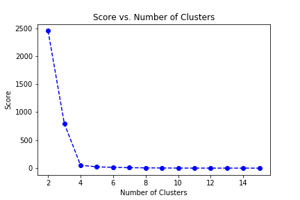

# Machine Learning Engineer Nanodegree
## Capstone Project
Ashley Adrias  
11/25/2019

## I. Definition

### Project Overview
We will explore the datasets and then perform k-means clustering on the dataset and then perform a/b testing on the testing set. This is a classification problem where we use demographic features to classify whether the customer will purchase the mail-order company or not. First, we need to convert the categorical features. Then we will clean the data for missing information. Next, we will perform dimensionality reduction (PCA) on the features to identify which combination of features affect the target classification. Upon identifying this feature, we will perform clustering(k-means) to the population of data. Finally, we will enter the Kaggle competition to test our model. We are looking for the number of principal components that explain close to 100% of the cumulative variance. Next, we need to figure out the number of clusters that provide us will the highest score and inertia. Finally, we look are the features of each cluster and use our expertise to name the cluster.

### Problem Statement
The purpose of this project is to analyze the demographics of a mail-order sales company in Germany. We will first create a model using an unsupervised learning technique to perform customer segmentation to identify features of the population that best describe the core customer base of the company. We will then use this model on unseen data with demographic information for targets of a marketing campaign for the company to predict which individuals are most likely to convert to becoming customers to the company.

### Metrics
There are four data files associated with this project. The first dataset is the demographics data for the general population of Germany. The second is the demographic data for customers of the mail-order company. The third set is demographic data for individuals who were targets of a marketing campaign used for training. The last set is the demographic data for individuals who were targets for a marketing campaign used for testing.

The data must be first fully explored to understand the datatype of the given features and what cleaning must be done on missing values. We then perform PCA and k-Means clustering to find the number of clusters. Finally, we will enter the Kaggle competition to test our model.

Input data:

•Udacity_AZDIAS_Subset.csv: Demographics data for the general population of Germany; 891211 persons (rows) x 85 features (columns).

•Udacity_CUSTOMERS_Subset.csv: Demographics data for customers of a mail-order company; 191652 persons (rows) x 85 features (columns).

•Data_Dictionary.md: Detailed information file about the features in the provided datasets.

•AZDIAS_Feature_Summary.csv: Summary of feature attributes for demographics data; 85 features (rows) x 4 columns

Kaggle uses probability of a reponse (target=1) to rank the LNR identifications. This is why we used the predict probability function, which gives a probability of a person being a customers.

## II. Analysis

### Data Exploration
In order to perform data exploration and exploratory visualization, each attribute had to categorized into either categorical or numerical types and a list of possible values had to created to facilitate data cleaning.

First, a clean features csv file was create where we see the attribute category type and possible values. This helps bin values that not within the possible values list into a common unknown value bin. This is the first step when cleaning the training and testing set. This lookup table was created with the help of the following two files:
- DIAS Information Levels - Attributes 2017.xlsx
- DIAS Attributes - Values 2017.xlsx

Subsequently, the clean features csv was crossed checked with the general population dataset (Udacity_AZDIAS_052019.csv). Upon performing this step, the number of features were reduced from 366 to 272 (excluded the LNR column). Out of these features, two were categorical (i.e OST_WEST_KZ, CAMEO_DEU_2015).

The features consisted of binned demographic data, such as age, gender, profession, household characteristics, buying habits, etc... These features are usually binned from 1 to 10 ( or else depending on the bin size). These were pre-determined bins provided by Arvato. The two categorical features were also binned into different string classes that ended up getting numerically encoded.

The unknown values had possible instances; -1, (0,-1), 'unknown', (-1,9). These values were cleaned and binned to 99 for numerical categories and 'unknown' for categorical features.

Upon applying the cleaning functioning to replace nan values and possible features, we apply scale the data. Here is an example of what the data looks like:

</img>

### Exploratory Visualization
After cleaning up the general population with the clean features csv, so plotted out the nan value distribution. Most of the 272 features had less than 15% of the data missing. The nan values were then filled with the median value of the feature (excluding nan points).

</img>

Lastly all datasets where matched to have the same 273 model features.

### Algorithms and Techniques
Unsuperved machine learning was used to identify cluster within the general and customer population within Germany. PCA (Principal Component Analysis) is used to reduce the dimensionality of the features to those that affect close to all the variance in the data. Once this is performed KMeans clustering is to identify groups within the data that share similar features. The best number of clusters to takes comes from the elbow diagram. The optimal number of clusters occurs at the elbow point after which the distortion(inertia) started to decrease linearly.
Upon cleaning the data, the features were scaled using an encoder from the sklearn package. The two categorical variables were encoded to numerical values. Next, PCA was applied to understand what features were prevalent in the general population (Udacity_AZDIAS_052018.csv).

It was observed that five components represent 100% of the variance.

Top 5 weights:

- ALTERSKATEGORIE_GROB    0.0005
- ANZ_HAUSHALTE_AKTIV     0.0004
- KBA13_ANZAHL_PKW        0.0002
- KBA05_MOD1             -0.0000
- KBA05_MAXAH            -0.0000

There were 5 cluster with the general population.

</img>

There were 3 features of the customer group:

- ALTER_HH = Main age within the household (High affinity)
- ALTERSKATEGORIE_GROB = age classification through prename analysis (High affinity)
- AGER_TYP = Best-ager Typology (Low Affinity)
- ALTER_HH = Best-ager Typology (Low Affinity)

The customer group belonged to cluster 2 and 4. 
</img>

Once all the data points have labels from their respective clusters, we can perform supervised machine learning to create a model that predicts the probability of a person becoming a customer from its cluster label.

We chose a Random Forest Classifier with the following parameters; n_estimators=500, max_depth=1000,random_state=10. This provided us with a ROC AUC Score of ~84%.

Before applying the model to the train dataset, we applied SMOTE, because the distribution of data points both target points (0,1) and cluster labels were uneven, which would result in a poor accuracy result. The goal of SMOTE to is to try and extrapolate the clustered data points within each target bin (0,1). This way we can train and test of similar types of possible data points.

The KMeans and Random Forest Classfier were then exported for use on the testing dataset. We decided to use Random Forest Classifier because the dataset was very similar to a Decision Tree of features that decide whether a person is most likely to be a customer or not. We had to increase the the depth size to 1000 to increase the AUC accuracy score, which produced the best result. We had originally tried to use XGBOOST but the kernal kept dieing, so we switched to an easier and faster classifier.

### Benchmark
Performing customer segmentation on the demographics data will enable us to create a model to segment the customer base. This is a classification problem where we use demographic features to classify whether the customer will purchase the mail-order company or not. First, we need to convert the categorical features. Then we will clean the data for missing information. Next, we will perform dimensionality reduction (PCA) on the features to identify which combination of features affect the target classification. Upon identifying this feature, we will perform clustering(k-means) to the population of data. Next, we use Random Forest Classifier to train the model. Finally, we will enter the Kaggle competition to test our model. We then use the Kaggle top performer as a benchmark. The top performer had an accuracy score of ~80%. A priori, the Random Forest Classfier seems promising as it had an AUC score of 84%.

## III. Methodology

### Data Preprocessing
The same cleaning and processing steps were used on the customer dataset (Udacity_CUSTOMERS_052019.csv) and the test/train datsets. A label encoder from the sklearn package was used on the categorical variables. The cleaning step convert all the data to there given type(numerical or categorical) by means to int or str string conversion. Then the data is is crossed checked with its possible values list. It the current value is not in the possible values list it is binned to an unknown bin, labeld 99 for numerical values and unknown for categorical values. Next, the NAN values was filled in the median value of the features. Lastly, the numerical data is ready for scaling and the categorical features are ready for encoding. This is the final step before applying PCA, Kmeans, and Random Forest Classifier.

### Implementation
Subsequently after processing the data, it was found that the train dataset (Udacity_MAILOUT_052019_TRAIN.csv) mostly consisted of data without responses. Please refer to jupyter notebooks for the cleaning functions. Next we apply PCA and KMeans clustering to label the data. Upon removing them, it was found to have an uneven amount of data for each cluster. A SMOTE technique was used to fit the distribution of the cluster and expand the number of data points to provide a more even dataset. Next, the training data was slipt 80/20 and straitfied. The model used was Random Forest Classifier. The AUC score was ~84%.

### Refinement
In order to make the model better. A survey of different algorithms should be performed and a voting classfier could be used. Also the feature set was greatly reduced from 366 to 272. In doing this, there may have loss of important information that would improve the model. Also, a Grid Serach tehcnique could be applied to the Random Forest Classifier model to optimize its parameters.

## IV. Results

### Model Evaluation and Validation
Subsequently after processing the data, it was found that the train dataset (Udacity_MAILOUT_052019_TRAIN.csv) mostly consisted of data without responses. Upon removing them, it was found to have an uneven amount of data for each cluster. A SMOTE technique was used to fit the distribution of the cluster and expand the number of data points to provide a more even dataset. Next, the training data was slipt 80/20 and straitfied. The model used was Random Forest Classifier. The AUC score was ~84%. However, when the model is applied to the test data that gets uploaded to the Kaggle competition, we recieved an accuracy score of 54%. This does not match or out perform the baseline (Kaggle Top Performer).It is recommended that we apply the methods describe in the reflection and improvements sections to help improve the model.

When faced with imbalanced classification problem using accuracy metrics such as precision/recall in a confusion matrix and AUC Curves are ideal. An AUC Curve plots the true positive rate vs. false positive rate. The result of an AUC accuracy score is the percentage of customers the model is able to distingush. The best possible score is 1 or 100%, where all true positives are distinguishable from the false positives.

### Justification
Upon applying the model to the test data and uploading the results to Kaggle, the model performed very poorly at an accuracy of 50%. This could be because many of the features were removed from the total feature set because they were not present in the attribute files. Due to these results, I would not yet trust the model. It is suggested that the point in the refinement section be performed and the results uploaded again to Kaggle. The current leader on the Kaggle competition had an accuracy of over 80%.

## V. Conclusion

### Reflection & Improvements
The purpose of this project is to analyze the demographics of a mail-order sales company in Germany. We will first create a model using an unsupervised learning technique to perform customer segmentation to identify features of the population that best describe the core customer base of the company. We will then use this model on unseen data with demographic information for targets of a marketing campaign for the company to predict which individuals are most likely to convert to becoming customers to the company.

Upon applying the model to the test data and uploading the results to Kaggle, the model performed very poorly at an accuracy of 50%. This could be because many of the features were removed from the total feature set because they were not present in the attribute files. Due to these results, I would not yet trust the model. It is suggested that the point in the refinement section be performed and the results uploaded again to Kaggle. The current leader on the Kaggle competition had an accuracy of over 80%. This tells us the model does not perform well on unseen data and it highly sensitive to changes.